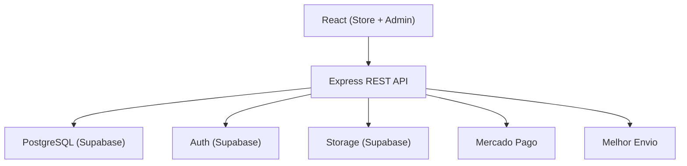
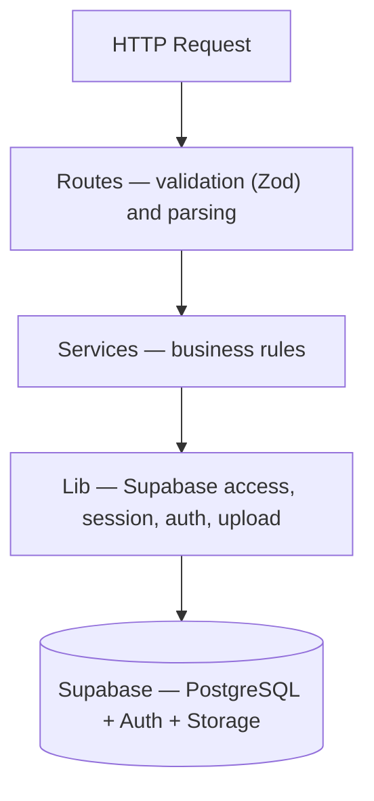
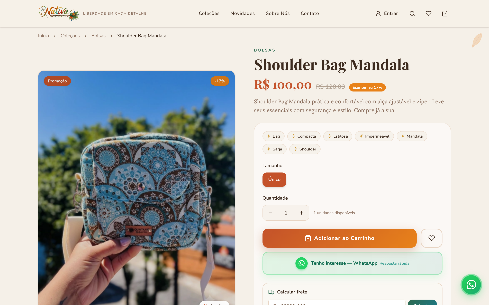
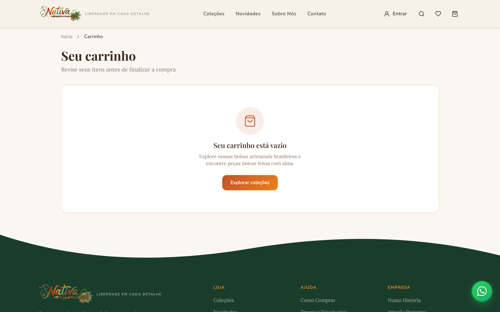
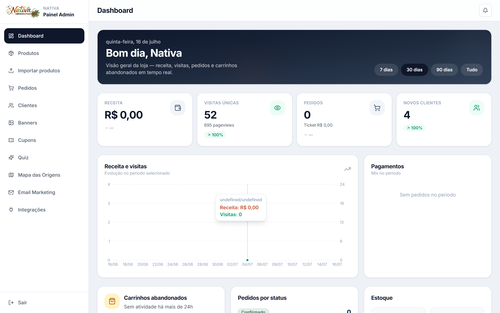

<p align="center">
  <!-- Replace with a real GIF (10-15s) walking through Home → Product → Cart → Checkout → Admin -->
  
</p>
<p align="center"><sub>Flow shown: Home → Product → Cart → Checkout</sub></p>

<h1 align="center">Nativa Store</h1>
<p align="center"><i>Liberdade em cada detalhe</i> — Nativa / Quintiluz brand</p>

<p align="center">
  <a href="README.md">🇧🇷 Português</a> ·
  <a href="README.en.md">🇺🇸 English</a>
</p>

<p align="center">
  
  <a href="docs/importacao-em-massa.md"></a>
  <a href="https://www.typescriptlang.org/"></a>
  <a href="https://react.dev/"></a>
  <a href="https://vitejs.dev/"></a>
  <a href="https://expressjs.com/"></a>
  <a href="https://supabase.com/"></a>
  <a href="https://vercel.com/"></a>
  <a href="LICENSE"></a>
</p>

<!-- Replace with the real deploy URL -->
<p align="center">
  <a href="https://nativa-store.vercel.app"></a>
  <a href="https://github.com/gabrielweweewe/nativa-store"></a>
</p>

<p align="center"><b>Project inspired by the brand's live store:</b> <a href="https://www.nativa.art.br">nativa.art.br</a></p>

> This project was built for a real handmade-goods e-commerce operation — public storefront, full admin panel, and production-minded architecture — not a tutorial CRUD app.

**Full-stack e-commerce platform** — public storefront, admin panel, customer auth, persistent cart, checkout with Mercado Pago and Melhor Envio, catalog migration from Nuvemshop, and Vercel deploy.

---

## Table of contents

- [Why this project?](#why-this-project)
- [Features](#features)
- [Main challenges](#main-challenges)
- [Architecture](#architecture)
- [Stack](#stack)
- [Security](#security)
- [Outcomes](#outcomes)
- [Screenshots](#screenshots)
- [Running locally](#running-locally)
- [Technical decisions](#technical-decisions)
- [What I learned](#what-i-learned)
- [Roadmap](#roadmap)

---

## Why this project?

This project mirrors a real e-commerce operation: authentication, data persistence, an admin panel, and migration of an existing catalog.

- Catalog migrated from a live Nuvemshop store via a dedicated CSV parser and controlled image extraction
- Business rules live on the backend — no critical logic in the client — so multiple frontends can share the same API later
- Admin panel with dashboard, orders, customers, notifications, and bulk import
- Hybrid cart: anonymous session cookie, merged into the customer's history on login
- Serverless deploy on Vercel, with frontend and API in the same repository

The goal was to recreate the hard parts of a real store operation — beyond a demo app.

---

## Features

### Storefront (customer)

| Feature | Detail |
|---------|--------|
| Catalog & PDP | Products with gallery, sizes, colors, FAQ, materials, and artisan story |
| Cart | Drawer + dedicated page; session cookie for guests; merge on login |
| Checkout | Address (ViaCEP), shipping quote, order summary, and Mercado Pago payment (Pix, card via Payment Brick, or boleto) |
| Customer account | Sign-up, login, password recovery, and email verification (Supabase Auth) |
| Orders | History and detail in the signed-in area |
| Shipping / coupon | Real-time quotes via Melhor Envio; free-shipping progress bar (configurable threshold) and coupon persisted on the cart |

> ⚠️ Payment environment (test or production) and Melhor Envio (sandbox or production) are configured under `/admin/integracoes`. In test/sandbox mode, no real charges or shipments are processed.

### Admin panel (`/admin`)

| Feature | Detail |
|---------|--------|
| Dashboard | Sales, visits, orders, and charts (Recharts) |
| Products | Full CRUD, image upload (Supabase Storage), tags, and featured items |
| Bulk import | CSV/XLSX with in-browser preview |
| Orders | List, filters, detail, and status updates |
| Customers | Profile, addresses, and purchase history |
| Integrations | Mercado Pago and Melhor Envio (encrypted credentials, test/sandbox and production environments) |
| Notifications | In-app bell for new orders and sign-ups (polling) |
| Admin auth | Single password + JWT in an `httpOnly` cookie (serverless-friendly) |

---

## Main challenges

**Migrate a real catalog without losing anything.** The source CSV was `latin1` and multiline, which broke conventional parsers. The fix was a dedicated parser plus controlled image extraction from the live storefront, preserving size and color variants.

**Unify guest and customer carts.** An anonymous cart stored in a cookie must merge into the customer's history on login — without duplicating or dropping items. The merge was designed to be idempotent.

**Run without in-memory state in serverless.** Vercel does not guarantee memory across requests. Admin session and cart identity live entirely in `httpOnly` cookies with JWT — never in server memory.

**Avoid duplication between frontend and backend.** Zod schemas in `shared/` are the single source of truth, consumed by both the API and the UI.

**Keep the public storefront bundle lean.** The admin is loaded via a lazy route so its code never ships to storefront visitors.

---

## Architecture

Monorepo with clear boundaries:

```
nativa-store/
├── client/          # React — UI and fetch to /api
├── server/          # Express — business rules, auth, Supabase
├── shared/          # Types, Zod schemas, mappers, constants
├── supabase/        # DDL (products, cart, orders, customers, payments, shipping, coupons, email, quiz, notifications, analytics…)
├── docs/            # Operational guides (e.g. bulk import)
└── api/             # Serverless bundle for Vercel
```

**Principle:** React never talks to the database. Every write goes through the API, with the service role confined to the server.



### Domain architecture (backend)



Additional engineering notes: admin loaded via **lazy route**, seed/migration/storage setup scripts, and lightweight page-view analytics per visitor session.

---

## Stack

| Area | Technology |
|------|------------|
| Language | TypeScript |
| Frontend | React 19, Vite 7 |
| Styling / UI | Tailwind CSS 4, Radix UI, shadcn-style, Framer Motion |
| Routing | Wouter |
| Charts | Recharts |
| Backend | Node.js, Express 4 |
| Database | PostgreSQL (Supabase) |
| Auth | Supabase Auth |
| Storage | Supabase Storage |
| Payments | Mercado Pago (Orders API + Payment Brick) |
| Shipping | Melhor Envio |
| Validation | Zod (shared between client and server) |
| Deploy | Vercel (SPA + serverless API) |
| Package manager | pnpm |

---

## Security

- `httpOnly` cookies for admin session and cart identity — inaccessible from browser JavaScript
- Supabase Service Role confined to the server, never exposed to the client
- Row Level Security (RLS) enabled on sensitive tables (profiles, addresses, orders)
- Input normalization (trim, phone/CEP formatting) before Zod validation
- Mercado Pago webhook (`/api/webhooks/mercado-pago`) with HMAC validation of the `x-signature` header and a time window
- Idempotent payment reconciliation (`reconcile_mercado_pago_payment` + per-attempt idempotency key), avoiding side effects from duplicate events
- Mercado Pago and Brevo credentials encrypted at rest (`MERCADO_PAGO_ENCRYPTION_KEY` / `BREVO_ENCRYPTION_KEY`)

---

## Outcomes

- Full migration of a live Nuvemshop catalog with no loss of product data, variants, or images
- Modeling of **25 PostgreSQL tables** in Supabase (products, cart, orders, customers, addresses, notifications, analytics, payments, shipping, coupons, email, and quiz)
- Real payment integration with Mercado Pago (Pix, card, and boleto), including a signed webhook and idempotent reconciliation
- Real-time shipping quotes via Melhor Envio, with quote persistence at checkout and free-shipping rules by threshold and/or coupon
- Architecture ready for multiple frontends on the same API (the client never accesses the database directly)
- Shared code and validation between frontend and backend, reducing duplication and drift bugs
- Automated Vercel deploy — from push to production

---

## Screenshots

<p align="center"><b>Home</b> — featured banner and product grid</p>
<p align="center">
  
</p>

<p align="center"><b>Home</b> — store paths and curation quiz</p>
<p align="center">
  
</p>

<p align="center"><b>Product page</b> — gallery, variants, shipping, and CTAs</p>
<p align="center">
  
</p>

<p align="center"><b>Cart</b> — items in the order</p>
<p align="center">
  
</p>

<p align="center"><b>Cart</b> — empty state</p>
<p align="center">
  
</p>

<p align="center"><b>Checkout</b> — address, shipping, and payment</p>
<p align="center">
  
</p>

<p align="center"><b>Customer account</b> — login and account benefits</p>
<p align="center">
  
</p>

<p align="center"><b>Admin panel</b> — login screen</p>
<p align="center">
  
</p>

<p align="center"><b>Admin panel</b> — sales metrics dashboard and charts</p>
<p align="center">
  
</p>

<p align="center"><b>Admin panel</b> — order management</p>
<p align="center">
  
</p>

<p align="center"><b>Admin panel</b> — product management</p>
<p align="center">
  
</p>

---

## Running locally

### Prerequisites

- Node.js 20+
- pnpm
- A [Supabase](https://supabase.com) project with the tables from `supabase/*.sql`

### Setup

```bash
pnpm install
cp .env.example .env
# Fill in SUPABASE_*, ADMIN_PASSWORD, and ADMIN_JWT_SECRET
# Additional vars apply (e.g. MERCADO_PAGO_ENCRYPTION_KEY, BREVO_ENCRYPTION_KEY);
# Melhor Envio: credentials in admin (/admin/integracoes) — see .env.example (APP_URL, etc.)
```

Run the SQLs in `supabase/` in the Supabase SQL Editor, in this order:
`setup.sql` → `customers.sql` → `cart.sql` → `orders.sql` → `customer_addresses.sql` → `admin_notifications.sql` → `store_analytics.sql` → `banners.sql` → `regions.sql` → `melhor_envio.sql` → `mercado_pago.sql` → `melhor_envio_checkout.sql` → `coupons.sql` → `coupons_map_reward.sql` → `brevo.sql` → `brevo_merchant_notify.sql` → `brevo_store_templates.sql` → `order_fulfillment.sql` → `quiz.sql` → `quiz_completions.sql`.

```bash
pnpm setup:storage   # image bucket (once)
pnpm dev             # client :3000 + API :3001
```

| Command | Description |
|---------|-------------|
| `pnpm dev` | Frontend + API together |
| `pnpm build` | Production build |
| `pnpm check` | TypeScript (`tsc --noEmit`) |
| `pnpm migrate:nuvemshop` | Reimport catalog from the Nuvemshop CSV |
| `pnpm seed` | Insert sample products |

Variable details and pitfalls: see [`.env.example`](.env.example).

---

## Technical decisions

| Problem | Solution |
|---------|----------|
| Share validation between client and server | Shared Zod schemas in `shared/schemas` |
| Keep critical logic off the frontend | Express API owns business rules; the client only consumes `/api` |
| Persistent cart across guest and customer | Session cookie for anonymous + idempotent merge on auth |
| Serverless compatibility | Stateless API with JWT in `httpOnly` cookies instead of in-memory sessions |
| Platform migration (Nuvemshop → Supabase) | `latin1` multiline CSV parser + controlled image extraction from the live store |
| Consistency between DB (snake_case) and TS (camelCase) | Dedicated mappers in `shared/lib` (`productMapper`, `orderMapper`, `cartMapper`, `addressMapper`) |
| Payment confirmation | Mercado Pago webhook with HMAC signature validation and idempotent Postgres reconciliation |
| Shipping calculation | Real-time Melhor Envio quotes; quote persisted (~30 min) and revalidated at checkout; free shipping by threshold and/or coupon |

---

## What I learned

- **React application architecture** at scale — separating UI from business rules and loading admin routes lazily
- **Monorepo organization**, with clear boundaries between client, server, and shared code
- **Layered backend development** (routes → services → lib), easier to test and maintain
- **Supabase integration** (PostgreSQL, Auth, and Storage) as a full backend-as-a-service platform
- **Multi-profile authentication** (customers via Supabase Auth, admin via JWT in an `httpOnly` cookie)
- **Serverless deploy**, adapting a traditionally stateful API to Vercel's execution model
- **Relational database modeling**, with RLS and tables for products, cart, orders, and customers
- **Shared validation schemas** between frontend and backend with Zod, eliminating duplicated rules
- **Legacy data migration** from Nuvemshop — encoding, CSV parsing, and image integrity
- **Third-party API integration** (Mercado Pago and Melhor Envio): OAuth/credentials, test/sandbox vs production, and network failures
- **Webhooks and idempotency**, validating signatures, reconciling payment status, and avoiding side effects from duplicate notifications

---

## Roadmap

- [ ] Store settings in the admin
- [ ] Advanced catalog search and filters
- [ ] Real customer reviews
- [ ] Finish migrating legacy images from the Nuvemshop CDN to Supabase Storage

---

## Internal docs

| File | Contents |
|------|----------|
| [`docs/importacao-em-massa.md`](docs/importacao-em-massa.md) | CSV/XLSX bulk import guide |
| [`ideas.md`](ideas.md) | Brand design direction |

---

## License

MIT — see the repository license file, if present.

---

<p align="center">
  Built with React, Express, and Supabase · Brazilian craft, in code
</p>
