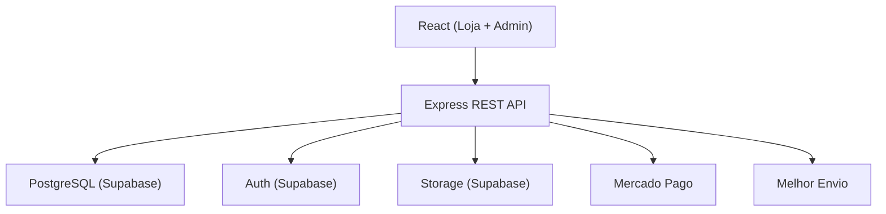
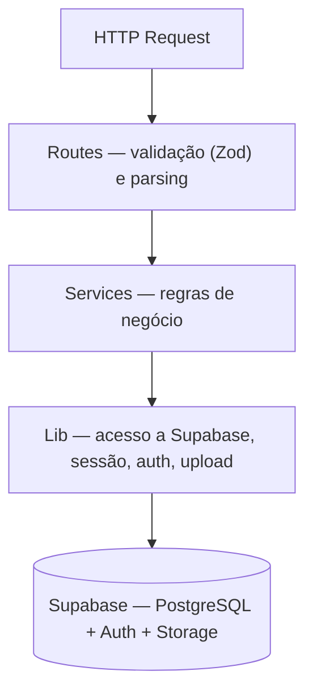
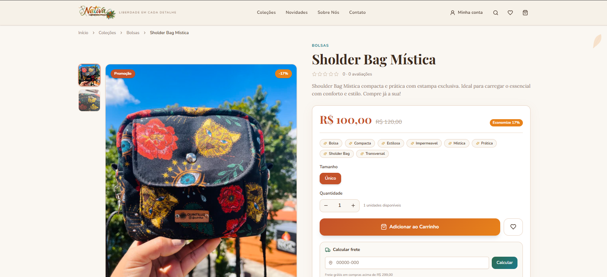
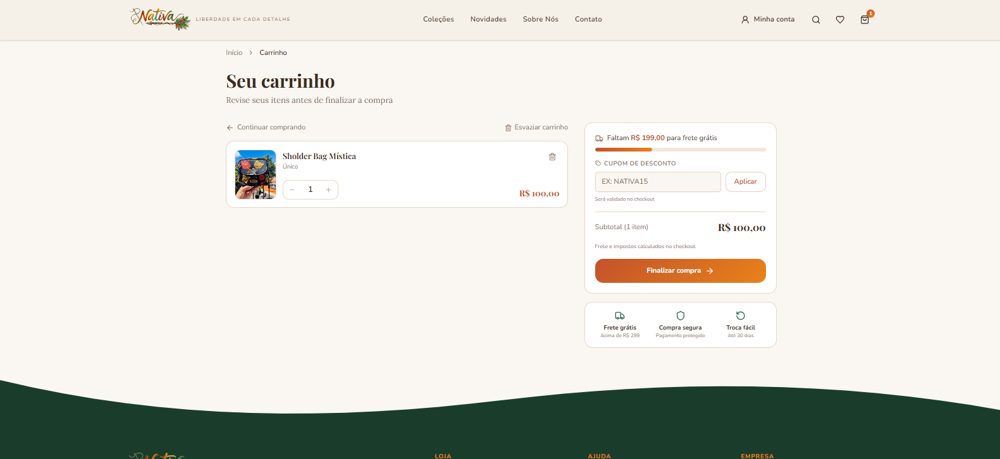
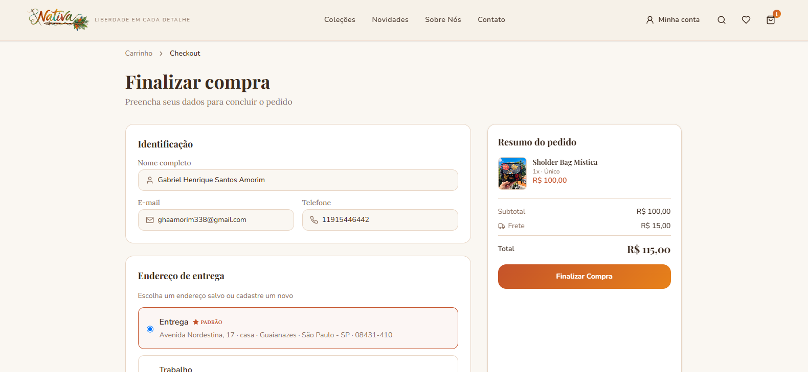
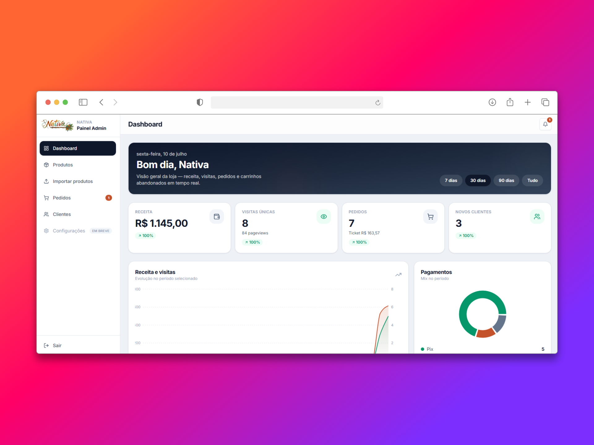
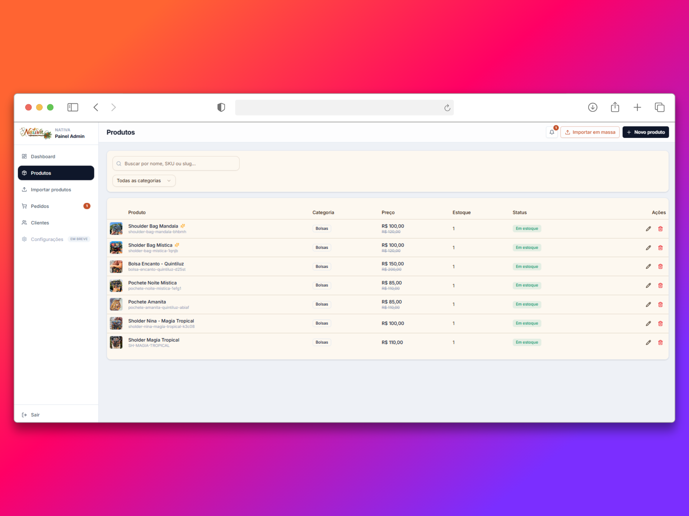

<p align="center">
  <!-- Substitua por um GIF real (10-15s) navegando Home → Produto → Carrinho → Checkout → Admin -->
  
</p>
<p align="center"><sub>Fluxo demonstrado: Home → Produto → Carrinho → Checkout</sub></p>

<h1 align="center">Nativa Store</h1>
<p align="center"><i>Liberdade em cada detalhe</i> — marca Nativa / Quintiluz</p>

<p align="center">
  <a href="README.md">🇧🇷 Português</a> ·
  <a href="README.en.md">🇺🇸 English</a>
</p>

<p align="center">
  
  <a href="docs/importacao-em-massa.md"></a>
  <a href="https://www.typescriptlang.org/"></a>
  <a href="https://react.dev/"></a>
  <a href="https://vitejs.dev/"></a>
  <a href="https://expressjs.com/"></a>
  <a href="https://supabase.com/"></a>
  <a href="https://vercel.com/"></a>
  <a href="LICENSE"></a>
</p>

<!-- Substitua pela URL real do deploy -->
<p align="center">
  <a href="https://nativa-store.vercel.app"></a>
  <a href="https://github.com/gabrielweweewe/nativa-store"></a>
</p>

<p align="center"><b>Projeto inspirado na operação da marca:</b> <a href="https://www.nativa.art.br">nativa.art.br</a></p>

> Este projeto foi desenvolvido para atender uma operação real de e-commerce de artesanato, com loja pública, painel administrativo completo e arquitetura pensada para produção — não um CRUD de tutorial.

**Plataforma completa de e-commerce** — loja pública, painel administrativo, autenticação de clientes, carrinho persistente, checkout com Mercado Pago e Melhor Envio, migração de catálogo a partir da Nuvemshop e deploy na Vercel.

---

## Índice

- [Por que este projeto?](#por-que-este-projeto)
- [Funcionalidades](#funcionalidades)
- [Principais desafios](#principais-desafios)
- [Arquitetura](#arquitetura)
- [Stack](#stack)
- [Segurança](#segurança)
- [Resultados](#resultados)
- [Screenshots](#screenshots)
- [Como rodar localmente](#como-rodar-localmente)
- [Decisões técnicas](#decisões-técnicas)
- [O que aprendi](#o-que-aprendi)
- [Roadmap](#roadmap)

---

## Por que este projeto?

Este projeto representa uma operação real de e-commerce: autenticação, persistência de dados, painel administrativo e migração de um catálogo existente.

- Catálogo migrado de uma loja Nuvemshop real, via parser de CSV e extração controlada de imagens
- Regra de negócio concentrada no backend, sem lógica crítica no cliente — o que permite evoluir para múltiplos frontends no futuro
- Painel admin com dashboard, pedidos, clientes, notificações e importação em massa
- Carrinho híbrido: sessão anônima por cookie, unificada ao histórico do cliente no login
- Deploy serverless na Vercel, com frontend e API no mesmo repositório

O objetivo deste projeto foi reproduzir os principais desafios encontrados em uma operação real de e-commerce, indo além de uma aplicação de demonstração.

---

## Funcionalidades

### Loja (cliente)

| Recurso | Detalhe |
|---------|---------|
| Catálogo e PDP | Produtos com galeria, tamanhos, cores, FAQ, materiais e história do artesão |
| Carrinho | Drawer + página dedicada; cookie de sessão para visitante; merge ao login |
| Checkout | Endereço (ViaCEP), cotação de frete, resumo do pedido e pagamento via Mercado Pago (Pix, cartão com Payment Brick ou boleto) |
| Conta do cliente | Cadastro, login, recuperação de senha e verificação de e-mail (Supabase Auth) |
| Pedidos | Histórico e detalhe na área logada |
| Frete / cupom | Cotação em tempo real via Melhor Envio; barra de frete grátis (threshold configurável) e cupom persistido no carrinho |

> ⚠️ O ambiente de pagamento (teste ou produção) e o Melhor Envio (sandbox ou produção) são configuráveis em `/admin/integracoes`. Em modo teste/sandbox, não há cobrança nem frete reais.

### Painel administrativo (`/admin`)

| Recurso | Detalhe |
|---------|---------|
| Dashboard | Métricas de vendas, visitas, pedidos e gráficos (Recharts) |
| Produtos | CRUD completo, upload de imagens (Supabase Storage), tags e destaques |
| Importação em massa | CSV/XLSX com pré-visualização no navegador |
| Pedidos | Lista, filtros, detalhe e alteração de status |
| Clientes | Perfil, endereços e histórico de compras |
| Integrações | Mercado Pago e Melhor Envio (credenciais criptografadas, ambientes teste/sandbox e produção) |
| Notificações | Sino in-app para novos pedidos e cadastros (polling) |
| Auth admin | Senha única + JWT em cookie `httpOnly` (adequado a serverless) |

---

## Principais desafios

**Migrar um catálogo real sem perder nada.** O CSV de origem, em `latin1` e multilinha, quebrava parsers convencionais. A solução foi um parser dedicado, aliado à extração controlada de imagens direto da loja publicada, preservando variações de tamanho e cor.

**Unificar carrinho de visitante e de cliente.** Um carrinho anônimo, guardado por cookie, precisa se juntar ao histórico do cliente no login — sem duplicar ou perder itens. O merge foi desenhado para ser idempotente.

**Rodar sem estado em ambiente serverless.** A Vercel não garante memória entre requisições. Sessão de admin e identidade de carrinho vivem inteiramente em cookies `httpOnly` com JWT, nunca em memória do servidor.

**Evitar duplicação entre frontend e backend.** Os schemas Zod em `shared/` são a única fonte de verdade, consumidos tanto pela API quanto pela UI.

**Manter o bundle da loja pública leve.** O admin é carregado via lazy route, garantindo que seu código não chegue ao cliente final da loja.

---

## Arquitetura

Monorepo com fronteiras claras:

```
nativa-store/
├── client/          # React — UI e fetch para /api
├── server/          # Express — regras de negócio, auth, Supabase
├── shared/          # Tipos, schemas Zod, mappers, constantes
├── supabase/        # DDL (products, cart, orders, customers, analytics…)
├── docs/            # Guias operacionais (ex.: importação em massa)
└── api/             # Bundle serverless para a Vercel
```

**Princípio:** o React não acessa o banco. Toda escrita passa pela API, com service role restrita ao servidor.



### Arquitetura de domínio (backend)



Notas de engenharia adicionais: admin carregado via **lazy route**, scripts de seed/migração/setup de storage, e analytics leve de page views por sessão de visitante.

---

## Stack

| Área | Tecnologia |
|------|------------|
| Linguagem | TypeScript |
| Frontend | React 19, Vite 7 |
| Estilo / UI | Tailwind CSS 4, Radix UI, shadcn-style, Framer Motion |
| Roteamento | Wouter |
| Gráficos | Recharts |
| Backend | Node.js, Express 4 |
| Banco de dados | PostgreSQL (Supabase) |
| Autenticação | Supabase Auth |
| Armazenamento | Supabase Storage |
| Pagamento | Mercado Pago (Orders API + Payment Brick) |
| Frete | Melhor Envio |
| Validação | Zod (compartilhada entre client e server) |
| Deploy | Vercel (SPA + API serverless) |
| Package manager | pnpm |

---

## Segurança

- Cookies `httpOnly` para sessão de admin e identidade de carrinho — inacessíveis via JavaScript no navegador
- Service Role do Supabase restrita ao servidor, nunca exposta ao client
- Row Level Security (RLS) habilitada nas tabelas sensíveis (perfis, endereços, pedidos)
- Normalização de inputs (trim, formato de telefone/CEP) antes da validação com Zod
- Webhook do Mercado Pago (`/api/webhooks/mercado-pago`) com validação HMAC da assinatura `x-signature` e janela de tempo
- Reconciliação de pagamento idempotente (`reconcile_mercado_pago_payment` + chave de idempotência por tentativa), evitando efeitos colaterais em eventos duplicados
- Credenciais de Mercado Pago e Brevo criptografadas no banco (`MERCADO_PAGO_ENCRYPTION_KEY` / `BREVO_ENCRYPTION_KEY`)

---

## Resultados

- Migração completa de um catálogo real da Nuvemshop, sem perda de dados de produto, variações ou imagens
- Modelagem de **25 tabelas PostgreSQL** no Supabase (produtos, carrinho, pedidos, clientes, endereços, notificações, analytics, pagamento, frete, cupons, e-mail e quiz)
- Integração de pagamento real com Mercado Pago (Pix, cartão e boleto), incluindo webhook com validação de assinatura e reconciliação idempotente
- Cotação de frete em tempo real via Melhor Envio, com persistência da cotação no checkout e regra de frete grátis por threshold/cupom
- Arquitetura pronta para múltiplos frontends consumindo a mesma API (o client nunca acessa o banco diretamente)
- Código e validação compartilhados entre frontend e backend, reduzindo duplicação e bugs de divergência
- Deploy automatizado na Vercel, do push à produção

---

## Screenshots

<p align="center"><b>Home</b> — banner de destaque e vitrine de produtos</p>
<p align="center">
  
</p>

<p align="center"><b>Página de produto</b> — galeria, variações e informações do artesão</p>
<p align="center">
  
</p>

### Carrinho

<!-- Inserir screenshot do carrinho -->

<p align="center">
  
</p>

---

### Checkout

<!-- Inserir screenshot do checkout -->

<p align="center">
  
</p>

<p align="center"><b>Painel admin</b> — dashboard com métricas de vendas e gráficos</p>
<p align="center">
  
</p>

<p align="center"><b>Painel admin</b> — gestão de pedidos</p>
<p align="center">
  
</p>

<p align="center"><b>Painel admin</b> — gestão de produtos</p>
<p align="center">
  
</p>

---

## Como rodar localmente

### Pré-requisitos

- Node.js 20+
- pnpm
- Projeto no [Supabase](https://supabase.com) com as tabelas de `supabase/*.sql`

### Setup

```bash
pnpm install
cp .env.example .env
# Preencha SUPABASE_*, ADMIN_PASSWORD e ADMIN_JWT_SECRET
```

Execute os SQLs em `supabase/` no SQL Editor do Supabase (na ordem: `setup` → `customers` → `cart` → `orders` → endereços → notificações → analytics).

```bash
pnpm setup:storage   # bucket de imagens (1x)
pnpm dev             # client :3000 + API :3001
```

| Comando | Descrição |
|---------|-----------|
| `pnpm dev` | Frontend + API juntos |
| `pnpm build` | Build de produção |
| `pnpm check` | TypeScript (`tsc --noEmit`) |
| `pnpm migrate:nuvemshop` | Reimporta catálogo a partir do CSV Nuvemshop |
| `pnpm seed` | Insere produtos de exemplo |

Detalhes de variáveis e armadilhas: ver [`.env.example`](.env.example).

---

## Decisões técnicas

| Problema | Solução |
|----------|---------|
| Compartilhar validação entre client e server | Zod compartilhado em `shared/schemas` |
| Evitar lógica crítica no frontend | API Express centraliza as regras de negócio; o client só consome `/api` |
| Carrinho persistente entre visitante e cliente | Cookie de sessão para anônimo + merge idempotente ao autenticar |
| Compatibilidade com ambiente serverless | API stateless, com JWT em cookie `httpOnly` em vez de sessão em memória |
| Migração de plataforma (Nuvemshop → Supabase) | Parser de CSV `latin1` multilinha + extração controlada de imagens da loja publicada |
| Consistência entre banco (snake_case) e TS (camelCase) | Mappers dedicados em `shared/lib` (`productMapper`, `orderMapper`, `cartMapper`, `addressMapper`) |
| Confirmação de pagamento | Webhook do Mercado Pago com validação de assinatura HMAC e reconciliação idempotente no Postgres |
| Cálculo de frete | Cotação em tempo real via Melhor Envio; cotação persistida (~30 min) e revalidada no checkout; frete grátis por threshold e/ou cupom |

---

## O que aprendi

- **Arquitetura de aplicações React** em escala, separando UI de regras de negócio e organizando rotas administrativas por lazy loading
- **Organização de monorepo**, com fronteiras claras entre client, server e código compartilhado
- **Desenvolvimento backend** orientado a camadas (routes → services → lib), facilitando testes e manutenção
- **Integração com Supabase** (PostgreSQL, Auth e Storage) como plataforma completa de backend-as-a-service
- **Autenticação** de múltiplos perfis (cliente via Supabase Auth, admin via JWT em cookie `httpOnly`)
- **Deploy serverless**, adaptando uma API tradicionalmente stateful para o modelo de execução da Vercel
- **Modelagem de banco de dados** relacional, com RLS e tabelas para produtos, carrinho, pedidos e clientes
- **Compartilhamento de schemas** de validação entre frontend e backend com Zod, eliminando duplicação de regras
- **Migração de dados** de uma plataforma legada (Nuvemshop), lidando com encoding, parsing de CSV e integridade de imagens
- **Integração com APIs de terceiros** (Mercado Pago e Melhor Envio): OAuth/credenciais, ambientes teste/sandbox vs produção e falhas de rede
- **Webhooks e idempotência**, validando assinaturas, reconciliando status de pagamento e evitando efeitos colaterais em notificações duplicadas

---

## Roadmap

- [ ] Configurações da loja no admin
- [ ] Busca e filtros avançados no catálogo
- [ ] Avaliações reais de clientes
- [ ] Migrar imagens restantes do CDN Nuvemshop → Supabase Storage

---

## Documentação interna

| Arquivo | Conteúdo |
|---------|----------|
| [`docs/importacao-em-massa.md`](docs/importacao-em-massa.md) | Guia da importação CSV/XLSX |
| [`ideas.md`](ideas.md) | Direção de design da marca |

---

## Licença

MIT — veja o arquivo de licença do repositório, se presente.

---

<p align="center">
  Feito com React, Express e Supabase · Artesanato brasileiro em código
</p>
